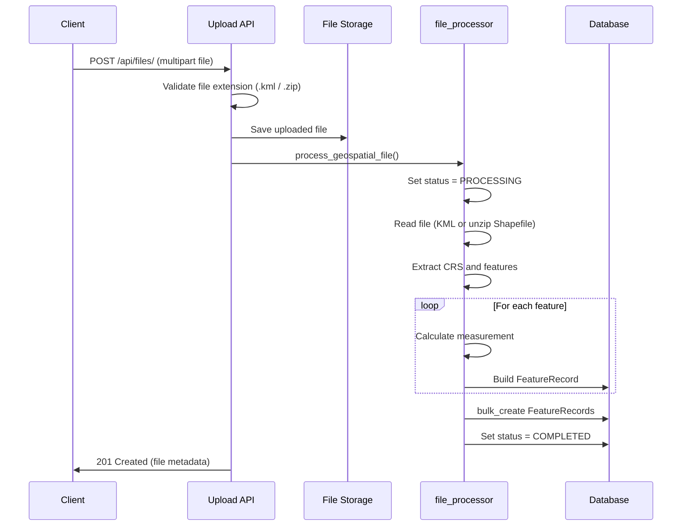
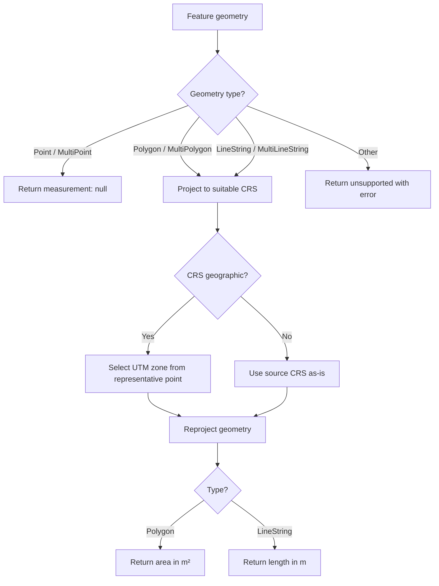

# Geospatial File Measurement API

A Django REST Framework backend that accepts geospatial files (Shapefile ZIP or KML), extracts features, calculates measurements, and returns results with correct CRS handling.

---

## Setup

### Prerequisites

- Python 3.11+
- GDAL (installed automatically via `geopandas` / `pyogrio` wheels on most platforms)

### Local development

```bash
# Clone or navigate to the project
cd GeoMeasurementAPI

# Create and activate a virtual environment
python3 -m venv .venv
source .venv/bin/activate        # macOS / Linux
# .venv\Scripts\activate         # Windows

# Install dependencies
pip install -r requirements.txt

# Apply database migrations
python manage.py migrate

# Start the development server
python manage.py runserver
```

The API is available at `http://127.0.0.1:8000/api/`.

> **Important:** All API URLs must end with a trailing slash (e.g. `/api/files/`, not `/api/files`). Django requires this for POST requests.

### Run tests

```bash
python manage.py test files
```

### Demo files for testing

Sample files are provided in `demo_data/`:

| File | Description |
|------|-------------|
| `sample.kml` | 1 Point, 1 LineString, 1 Polygon |
| `sample_points.zip` | Shapefile with 2 points |
| `sample_lines.zip` | Shapefile with 2 linestrings |
| `sample_polygons.zip` | Shapefile with 2 polygons |

See `demo_data/POSTMAN_GUIDE.md` for Postman instructions.

---

## API

### Base URL

```
http://127.0.0.1:8000/api/
```

### Supported upload formats

| Format | Extension | Notes |
|--------|-----------|-------|
| KML | `.kml` | Read directly via GeoPandas / Fiona |
| Shapefile | `.zip` | ZIP must contain at least one `.shp` file |

---

### 1. Upload and process a file

Uploads a geospatial file, processes all features, and stores measurements.

```
POST /api/files/
Content-Type: multipart/form-data
```

**Request body (form-data)**

| Field | Type | Required | Description |
|-------|------|----------|-------------|
| `file` | File | Yes | `.kml` or `.zip` containing a Shapefile |

**cURL example**

```bash
curl -X POST http://127.0.0.1:8000/api/files/ \
  -F "file=@demo_data/sample.kml"
```

**Success response — `201 Created`**

```json
{
  "id": "f47ac10b-58cc-4372-a567-0e02b2c3d479",
  "filename": "sample.kml",
  "feature_count": 3,
  "crs": "EPSG:4326",
  "status": "COMPLETED",
  "error_message": "",
  "created_at": "2026-10-07T06:45:00.123456Z",
  "updated_at": "2026-10-07T06:45:00.456789Z"
}
```

**Error response — `400 Bad Request`** (invalid file type or processing failure)

```json
{
  "id": "f47ac10b-58cc-4372-a567-0e02b2c3d479",
  "filename": "notes.txt",
  "status": "FAILED",
  "error": "Unsupported file type. Upload a .zip containing a Shapefile or a .kml file."
}
```

**Validation error — `400 Bad Request`** (before save)

```json
{
  "file": [
    "Unsupported file type. Upload a .zip containing a Shapefile or a .kml file."
  ]
}
```

---

### 2. Get file information

Returns metadata about an uploaded file.

```
GET /api/files/{id}/
```

**cURL example**

```bash
curl http://127.0.0.1:8000/api/files/f47ac10b-58cc-4372-a567-0e02b2c3d479/
```

**Success response — `200 OK`**

```json
{
  "id": "f47ac10b-58cc-4372-a567-0e02b2c3d479",
  "filename": "sample.kml",
  "feature_count": 3,
  "crs": "EPSG:4326",
  "status": "COMPLETED",
  "error_message": "",
  "created_at": "2026-10-07T06:45:00.123456Z",
  "updated_at": "2026-10-07T06:45:00.456789Z"
}
```

**Not found — `404 Not Found`**

```json
{
  "detail": "Not found."
}
```

---

### 3. Get measurements

Returns all features and their measurements for an uploaded file.

```
GET /api/files/{id}/measurements/
```

**cURL example**

```bash
curl http://127.0.0.1:8000/api/files/f47ac10b-58cc-4372-a567-0e02b2c3d479/measurements/
```

**Success response — `200 OK`**

```json
{
  "file_id": "f47ac10b-58cc-4372-a567-0e02b2c3d479",
  "filename": "sample.kml",
  "crs": "EPSG:4326",
  "feature_count": 3,
  "features": [
    {
      "id": "a1b2c3d4-e5f6-7890-abcd-ef1234567890",
      "index": 0,
      "geometry_type": "Point",
      "geometry": {
        "type": "Point",
        "coordinates": [77.5946, 12.9716]
      },
      "crs": "EPSG:4326",
      "properties": {
        "Name": "Survey Point A",
        "site_id": "PT-001",
        "category": "reference"
      },
      "measurement": null
    },
    {
      "id": "b2c3d4e5-f6a7-8901-bcde-f12345678901",
      "index": 1,
      "geometry_type": "LineString",
      "geometry": {
        "type": "LineString",
        "coordinates": [
          [77.5946, 12.9716],
          [77.5956, 12.9726],
          [77.5966, 12.9730]
        ]
      },
      "crs": "EPSG:4326",
      "properties": {
        "Name": "Road Segment",
        "site_id": "LN-001",
        "category": "road"
      },
      "measurement": {
        "type": "length",
        "value": 152.34,
        "unit": "m"
      }
    },
    {
      "id": "c3d4e5f6-a7b8-9012-cdef-123456789012",
      "index": 2,
      "geometry_type": "Polygon",
      "geometry": {
        "type": "Polygon",
        "coordinates": [
          [
            [77.5940, 12.9710],
            [77.5950, 12.9710],
            [77.5950, 12.9720],
            [77.5940, 12.9720],
            [77.5940, 12.9710]
          ]
        ]
      },
      "crs": "EPSG:4326",
      "properties": {
        "Name": "Plot Boundary",
        "site_id": "PG-001",
        "category": "parcel"
      },
      "measurement": {
        "type": "area",
        "value": 12345.67,
        "unit": "m2"
      }
    }
  ]
}
```

**Measurement rules**

| Geometry type | Measurement | Unit |
|---------------|-------------|------|
| `Point`, `MultiPoint` | `null` | — |
| `LineString`, `MultiLineString` | length | `m` |
| `Polygon`, `MultiPolygon` | area | `m2` |
| Unsupported (e.g. `GeometryCollection`) | error returned in `measurement.error` | — |

**Failed processing — `400 Bad Request`**

```json
{
  "file_id": "f47ac10b-58cc-4372-a567-0e02b2c3d479",
  "status": "FAILED",
  "error": "No .shp file found inside the uploaded zip archive.",
  "features": []
}
```

---

## Architecture

### Application structure

```
GeoMeasurementAPI/
├── config/                     # Django project configuration
│   ├── settings.py             # App settings, REST framework config
│   ├── urls.py                 # Root URL routing
│   └── wsgi.py
├── files/                      # Main application
│   ├── models.py               # GeospatialFile, FeatureRecord
│   ├── views.py                # API view classes
│   ├── serializers.py          # Request/response serialization
│   ├── urls.py                 # API route definitions
│   ├── admin.py                # Django admin registration
│   └── services/               # Business logic layer
│       ├── file_processor.py   # File ingestion and feature extraction
│       ├── measurements.py     # Area/length calculation
│       └── crs.py              # CRS detection and UTM selection
├── demo_data/                  # Sample files for manual testing
├── media/                      # Uploaded files (created at runtime)
├── manage.py
└── requirements.txt
```

**Layer responsibilities**

| Layer | Role |
|-------|------|
| `views.py` | HTTP handling, status codes, response formatting |
| `serializers.py` | Input validation and output shaping |
| `models.py` | Persistent storage of files and feature data |
| `services/` | Geospatial processing logic (decoupled from HTTP) |

---

### File-processing flow



**Step-by-step**

1. Client uploads a file via `POST /api/files/`.
2. Serializer validates the file extension (`.kml` or `.zip`).
3. File is saved to `media/uploads/` and a `GeospatialFile` record is created.
4. `process_geospatial_file()` is called synchronously:
   - **KML:** read directly with GeoPandas (`driver="KML"`).
   - **ZIP:** extract to a temp directory, locate the first `.shp`, read with GeoPandas.
5. For each feature row:
   - Skip empty geometries.
   - Serialize attribute columns to JSON-safe properties.
   - Compute measurement via `calculate_measurement()`.
   - Build a `FeatureRecord` with geometry (GeoJSON), CRS, properties, and measurement.
6. All feature records are bulk-inserted; file status is set to `COMPLETED`.
7. On failure, status is set to `FAILED` and an error message is stored.

---

### Measurement calculation flow



**Per geometry type**

| Type | Action |
|------|--------|
| `Point`, `MultiPoint` | No measurement (`measurement: null`) |
| `Polygon`, `MultiPolygon` | Reproject → compute Shapely `.area` → return m² |
| `LineString`, `MultiLineString` | Reproject → compute Shapely `.length` → return m |
| Unsupported types | Return `measurement.type: "unsupported"` with an error message |

Errors during measurement (e.g. invalid geometry) are caught per-feature so one bad geometry does not crash the entire upload.

---

### CRS handling

Geographic coordinate systems (e.g. `EPSG:4326`) express coordinates in **degrees**. Computing area or length directly in degrees produces meaningless results. The service always reprojects to a **projected CRS** before measuring.

**Strategy: UTM zone selection**

1. Detect whether the source CRS is geographic using `pyproj`.
2. If already projected (e.g. `EPSG:32643`), use it directly for measurements.
3. If geographic, pick a UTM EPSG code based on a representative point of the geometry:
   - **Polygon / MultiPolygon** → centroid
   - **LineString / MultiLineString** → midpoint (50% along the line)
   - **Other** → representative point
4. UTM zone is computed from longitude; hemisphere (north/south) is determined from latitude:
   - Northern hemisphere → `EPSG:32600 + zone`
   - Southern hemisphere → `EPSG:32700 + zone`
5. Geometry is reprojected with GeoPandas `to_crs()` and measured in meters.

**Example**

A polygon near Bangalore (`12.97°N, 77.59°E`) in `EPSG:4326` is reprojected to `EPSG:43N` (UTM zone 43N) before area is calculated, yielding square meters.

---

## Design Decisions

### 1. Django REST Framework over FastAPI

**Chosen:** Django REST Framework

**Why:** Built-in admin panel, ORM, migrations, and file upload handling reduce boilerplate for a data-centric API. DRF serializers provide clean request validation and response formatting.

**Alternative considered:** FastAPI — faster for async I/O and auto-generated OpenAPI docs, but would require separate file storage and database tooling.

---

### 2. Synchronous processing on upload

**Chosen:** Process the file immediately in the upload request and store results in the database.

**Why:** Simplest flow for the assignment requirements. Clients get a `COMPLETED` status in the upload response and can immediately fetch measurements.

**Alternative considered:** Async processing with Celery/RQ — better for large files and high throughput, but adds infrastructure complexity (message broker, worker processes) beyond the scope of this project.

---

### 3. GeoPandas + Shapely for geospatial operations

**Chosen:** GeoPandas for file reading and CRS transformation; Shapely for geometry operations.

**Why:** GeoPandas wraps GDAL/Fiona and provides a pandas-like API for reading KML and Shapefiles. Shapely handles geometry measurement after reprojection.

**Alternative considered:** Raw GDAL/OGR Python bindings — more control but significantly more verbose. `geopy` was not used because it is designed for geodesic point-to-point distance, not polygon area or complex geometry operations.

---

### 4. UTM projection for measurements

**Chosen:** Per-geometry UTM zone based on a representative point.

**Why:** UTM provides meter-based coordinates with low distortion for local measurements. Selecting the zone per geometry handles files that span areas reasonably well.

**Alternatives considered:**
- **Web Mercator (`EPSG:3857`)** — distorts area significantly at non-equatorial latitudes; unsuitable for area measurement.
- **Global equal-area projection (e.g. `EPSG:6933`)** — consistent worldwide but less accurate for local parcel-level measurements than UTM.
- **Geodesic calculation (e.g. `pyproj.Geod`)** — most accurate for geographic CRS, but UTM reprojection is simpler and sufficient for this use case.

---

### 5. Persist features and measurements in the database

**Chosen:** Store each feature as a `FeatureRecord` row with precomputed measurements.

**Why:** Measurements can be retrieved instantly via `GET /api/files/{id}/measurements/` without reprocessing the file. Supports status tracking and error reporting per file.

**Alternative considered:** On-demand reprocessing on each measurements request — simpler storage but slower and non-deterministic if processing logic changes.

---

### 6. SQLite for development

**Chosen:** SQLite as the default database.

**Why:** Zero configuration for local development and evaluation. Sufficient for the expected workload.

**Alternative considered:** PostgreSQL with PostGIS — production-grade geospatial storage and spatial indexing, but requires additional setup for a take-home assignment.

---

### 7. Shapefile delivered as ZIP

**Chosen:** Accept `.zip` archives containing Shapefile components (`.shp`, `.shx`, `.dbf`, `.prj`).

**Why:** Shapefiles are multi-file formats; ZIP is the standard distribution format. The processor extracts to a temp directory and reads the first `.shp` found.

**Note:** Shapefiles support only one geometry type per file. Demo shapefiles in `demo_data/` are split into separate archives per geometry type. Use `sample.kml` to test all geometry types in a single upload.

---

### 8. Graceful handling of unsupported geometries

**Chosen:** Catch errors per feature; return `measurement.error` instead of failing the entire upload.

**Why:** Real-world geospatial files may contain `GeometryCollection` or malformed features mixed with valid data. Partial success is more useful than a hard crash.

---

## License

This project was built as a technical assessment submission.
